# mSWE-GNN on the Ahr — overview of all runs and investigations

Working document for the thesis. Collects every training/evaluation experiment so far, with
metrics, configuration, findings, and the prediction-vs-ground-truth figures
(extracted from the executed notebooks into `results/thesis_overview/`).

**How to read the metrics** (all computed on the full ~118-step autoregressive rollout of the
Ahr 2021 event, which is also the training event — so they measure reproduction, not generalization):
- **RMSE WD [m]** — rollout RMSE on water depth over *all* nodes (unmasked), averaged over time.
  Not comparable with training losses (those apply shallow-cell weighting and velocity scaling).
- **CSI@θ** — Critical Success Index of the wet/dry classification at threshold θ, averaged over time.
- Rows from HAL8 logs report `test roll loss WD` from `finetune_ahr.py` (same definition).

---

## Master table (chronological)

| # | Run / checkpoint | Dataset (GT) | Loss configuration | Model | RMSE WD | CSI@0.05 | CSI@0.30 | Verdict |
|---|---|---|---|---|---|---|---|---|
| 1 | `finetuned_dk15` on `additionalsrc` (cold start) | non-warmstart | RMSE, conservation 0.01 (era) | hid64 | MAE 0.147¹ | 0.000 | 0.000 | cold start: model never initiates flooding |
| 2 | `finetuned_dk15` on `additionalsrc_100m` (cold start) | non-warmstart, 100 m | idem | hid64 | MAE 0.044¹ | 0.000 | 0.000 | idem → motivated warm start |
| 3 | `finetuned_dk15` on warmstart data | warmstart (old GT) | idem | hid64 | MAE 5.72¹ | 0.408 | 0.265 | warm start unlocks prediction; old model weak |
| 4 | `last.ckpt` (finetune 100m velocity) | warmstart (old GT) | RMSE + conservation 0.01, unweighted | hid64 | 0.470 | 0.589 | 0.561 | conservation era baseline |
| 5 | `best_invertedmeshes_1` | warmstart (old GT) | idem, after multiscale-ordering fix | hid64 | 0.424 | 0.716 | 0.587 | mesh-ordering fix helped extent, not depth |
| 6 | `finetuned_ahr_best_scale0loss` | warmstart (old GT) | scale-0 loss | hid64 | 0.479 | 0.626 | 0.576 | scale-0 loss ≈ neutral |
| 7 | `best_changed_lossandCSI` | warmstart (old GT) | modified loss + CSI term (early attempt) | hid64 | 0.513 | 0.147 | 0.072 | failed — loss change destabilized training |
| 8 | `sweepbest_changed_lr&loss` | warmstart (old GT) | changed lr + loss | hid64 (795k) | 0.512 | 0.176 | 0.237 | failed |
| 9 | `finetune_weighted_rmse` | warmstart (old GT) | weighted RMSE (sw=3, thr 0.30), no conservation, rollout-10 curriculum | hid64 (795k) | 0.262 | 0.547 | 0.588 | weighting era begins; big RMSE gain vs #4 |
| 10 | `finetune_weighted_rmse_extended` | warmstart (old GT) | idem, extended training | hid64 | 0.340 | 0.369 | 0.488 | longer training degraded (over-wetting) |
| 11 | `best_sweep_weightedrmse` | warmstart (old GT) | weighted RMSE (sw=5), sweep-optimized | hid32 (193k) | 0.225 | 0.601 | 0.618 | hid32 sweep config validated |
| 12 | `best_sweep_valloss_weightedrmse` | warmstart (old GT) | idem | hid32 | 0.198 | 0.674 | 0.679 | best of the old-GT era |
| 13 | `last_sweep_valloss_weightedrmse` | warmstart (old GT) | idem (last epoch) | hid32 | 0.334 | 0.583 | 0.632 | last < best |
| 14 | `last_outflow_BC_weightedrmse` | gc dataset (old GT), **BC = GT water depth (leak)** | weighted RMSE (sw=5) + outflow ghost cells | hid32 | 0.656 | 0.475 | 0.490 | BC leak discovered; ghost cells inert |
| 15 | — BC ablation on #14 (forcing zeroed) | idem | — | — | — | 0.475 | — | **model ignores forcing entirely** (0.4745 vs 0.4753) |
| 16 | HAL8 233342 (Q-forcing rerun) | gc dataset (old GT), **BC = Q** | weighted RMSE (sw=5), 2000 ep, patience 500 | hid32 | 0.297 | 0.567 | 0.611 | honest forcing costs nothing |
| 17 | HAL8 233531 (idem) | idem | idem | hid32 | 0.257 | 0.593 | 0.612 | idem |
| 18 | HAL8 233547 (idem) | idem | idem | hid32 | 0.259 | 0.533 | 0.588 | idem — single-event plateau confirmed |
| 19 | `best_sweep_new_gt` (best val_loss) | warmstart (**new GT**, Jul 4 rerun) | weighted RMSE (sw=5), 1000 ep | hid32 | **0.146** | 0.680 | **0.834** | best RMSE ever |
| 20 | `best_sweep_new_gt_bestCSI` (best val_CSI) | idem | idem (dual checkpoint) | hid32 | 0.160 | **0.741** | 0.794 | **best CSI ever**; FN nearly eliminated |
| 21 | `last_sweep_new_gt` | idem | idem (last epoch) | hid32 | 0.340 | 0.629 | 0.730 | last drifts into over-wetting again |

¹ rows 1–3: metric is unmasked MAE (old notebook convention), not RMSE — not comparable with the other rows.

---

## Phase 1 — Transfer / cold-start inference (early June)

Pretrained + early-fine-tuned model (`finetuned_dk15`) applied to the Ahr datasets **without warm
start**: CSI = 0 at every threshold. With a discharge-only forcing at 7 cells and a dry initial
state, the model never initiates flooding. This motivated (a) the warm-start dataset and
(b) adding velocity u/v as predicted variables.

| | |
|---|---|
| 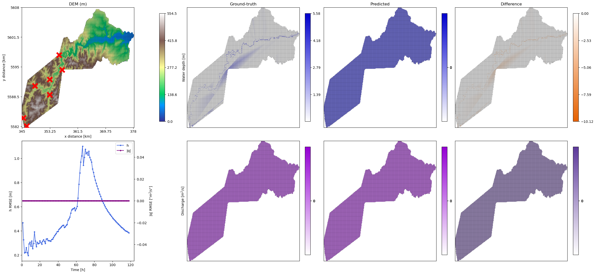 | 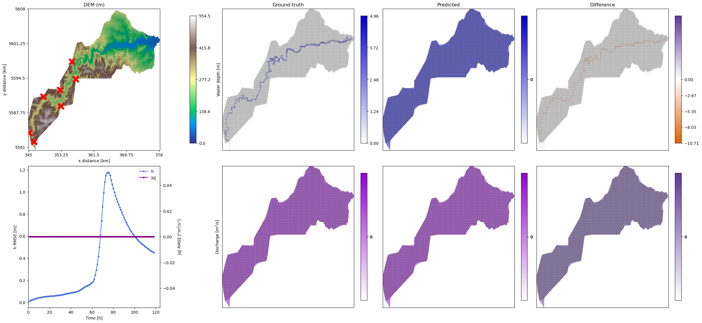 |

*(left: original resolution; right: 100 m — prediction stays dry while SFINCS floods)*

## Phase 2 — Early fine-tuning: conservation term, mesh ordering, loss experiments (mid June)

Loss = plain masked RMSE + mass-conservation penalty (0.01). Two failed loss modifications
(#7 `changed_lossandCSI`, #8 `changed lr&loss`) taught us that aggressive loss changes destabilize
training. The multiscale mesh-ordering fix (#5) improved flood extent (CSI@0.05 0.72) but not
depth accuracy — first evidence that RMSE and CSI reward different things.

| baseline (#4) | inverted meshes (#5) |
|---|---|
| 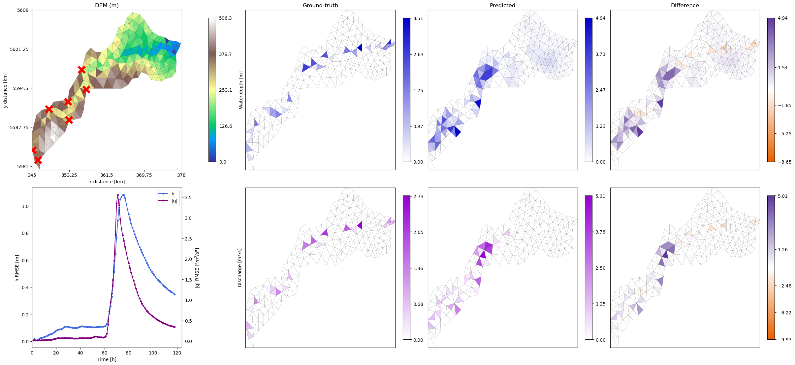 | 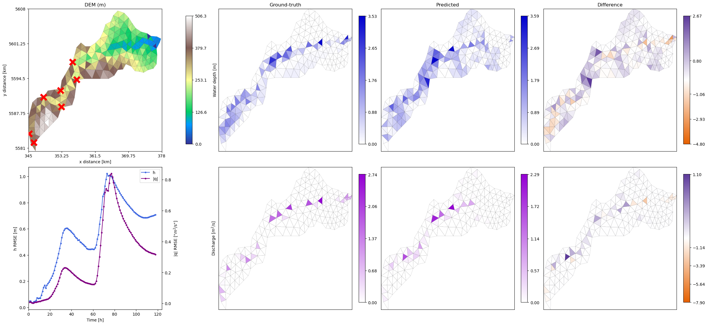 |

| failed loss change (#7) | failed lr+loss change (#8) |
|---|---|
| 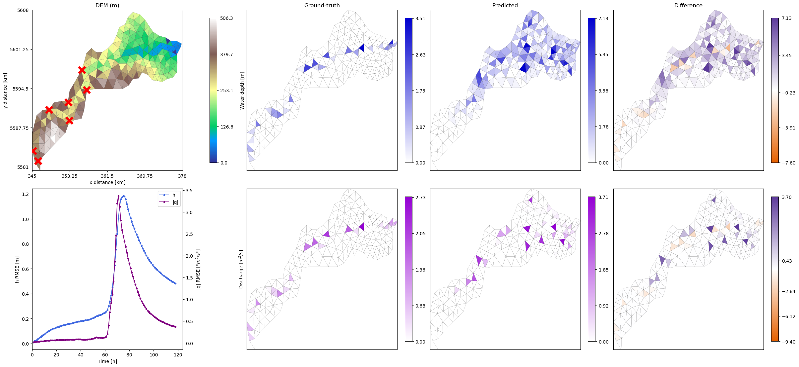 | 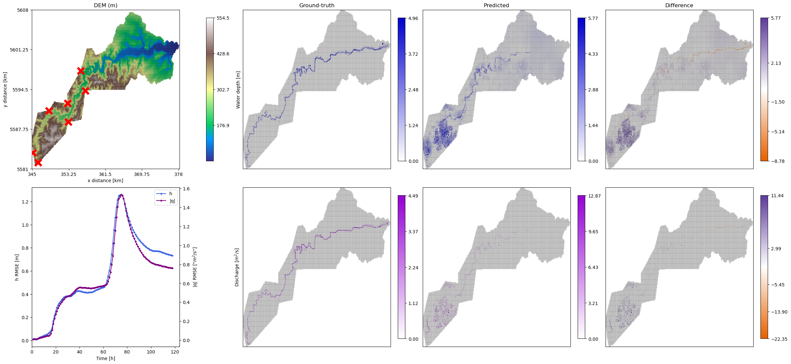 |

## Phase 3 — Weighted RMSE (shallow_weight), no conservation (late June)

Loss = masked RMSE with shallow wet cells (0 < WD ≤ 0.30 m) upweighted (w=3 → w=5 after sweep),
velocity errors ×7, conservation off. Hyperparameter sweep validated **hid32** (193k params)
over hid64 (795k). Best of the era: #12 (RMSE 0.198, CSI@0.05 0.674).

**Diagnostics finding** (notebook `compare_weighted_rmse_runs.ipynb`): CSI decays monotonically
along the rollout; errors are FP-dominated (progressive over-wetting, no drying on recession) plus a
flood-front lag on the rising limb; misclassified cells are NOT near-threshold → neither MAE nor
more shallow weighting targets the real failure mode.

| finetune_weighted_rmse (#9) | best_sweep_valloss (#12) |
|---|---|
| 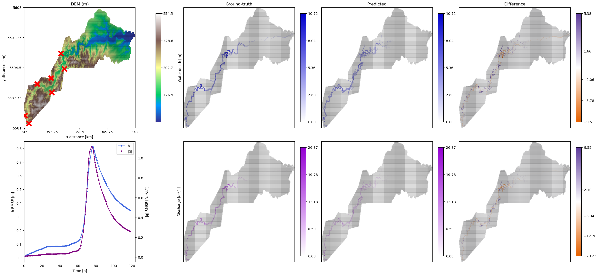 | 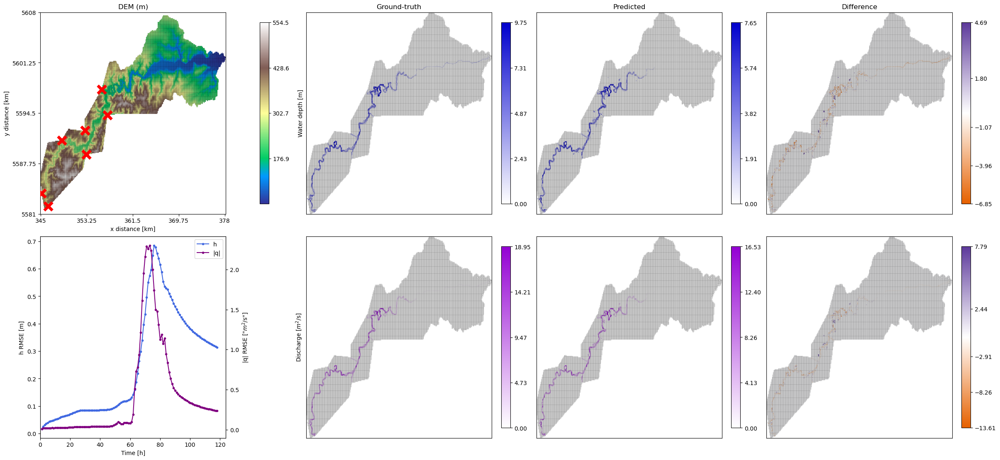 |

Additional per-model final-timestep maps: `results/thesis_overview/compare_weighted_rmse_runs__c23_*.png`

## Phase 4 — Boundary conditions: outflow ghost cells, forcing leak, ablation (early July)

- Implemented 87 outflow ghost cells (SFINCS msk==3 mirrors). Found they are **inert**: one-way
  interior→ghost edges mean the interior never receives information from them.
- Found the gc dataset fed the model **SFINCS's own water depth** at the 7 source points
  (fallback bug) instead of the discharge Q → fixed to Q (type_BC=2, peak 450 m³/s).
- **Ablation (key result)**: zeroing the forcing leaves CSI unchanged (0.4745 → 0.4753).
  Trained on a single event, the model memorizes the flood and ignores its inputs →
  no loss/training change can fix this; only multi-hydrograph training data can.
- Q-forcing reruns (2000 epochs, early stopping): CSI 0.53–0.59, same band as before.

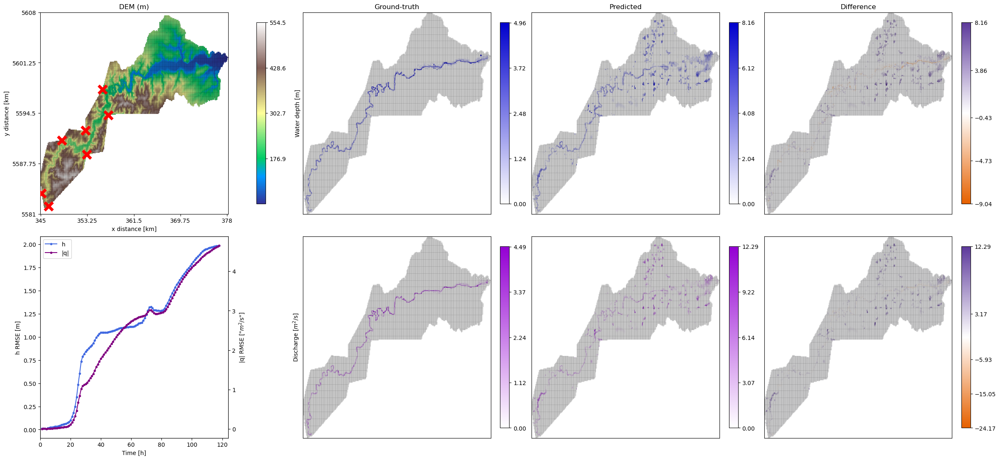

## Phase 5 — New ground truth (longer spinup) + dual checkpointing (Jul 4–5)

SFINCS warmstart simulation re-run with a **6-day spinup** (previously shorter): at t=0 the river
is now wet along its **full extent**, whereas before the last ~7 km of the downstream reach were
still dry at initialization (wet cells at t=0: 780 → 973). Dataset rebuilt (with a
NaN-interpolation fix in the conversion pipeline). `finetune_ahr.py` now saves two checkpoints:
best val_loss AND best val_CSI_005.

Result: **CSI@0.05 = 0.741** (new best) and CSI@0.30 = 0.834; misses (FN) nearly eliminated
(4–5% of wet cells vs 15–26% before). The longer spinup explains the FN collapse: the old
"flood-front lag" in the downstream reach was largely an **initialization artifact** — the model
had to *create* water in an initially dry river stretch, the hardest task for an autoregressive
model started from a warm state. With the channel pre-wetted, the model only has to propagate and
amplify. Remaining failure mode: scattered false-alarm over-wetting, growing on the recession.

| best val_loss (#19) | best CSI (#20) | last (#21) |
|---|---|---|
| 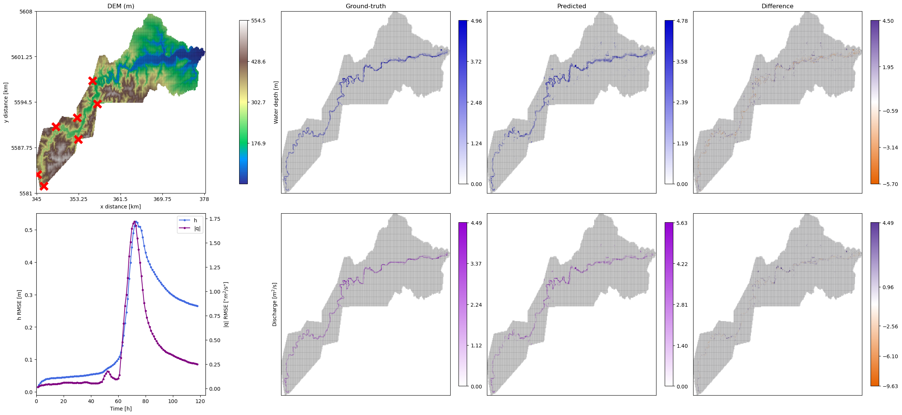 |  | 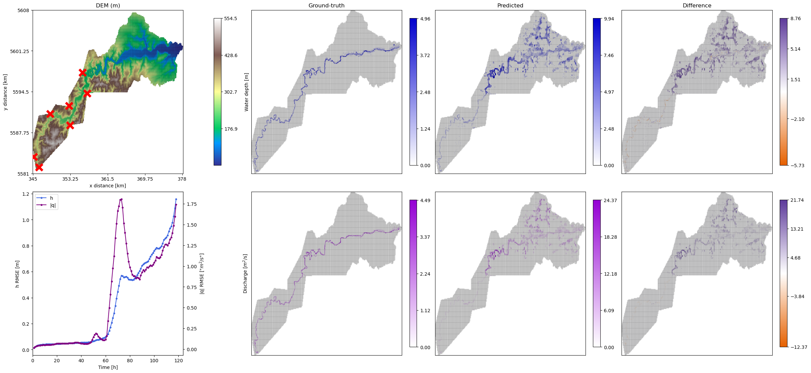 |

---

## Cross-cutting findings (thesis narrative)

1. **Warm start is necessary** with point-source forcing: cold-start CSI = 0 (Phase 1). And the
   *quality* of the warm start matters as much as its presence: extending the SFINCS spinup to
   6 days (fully wetted river at t=0) removed most of the downstream misses that had been
   attributed to model drift (Phase 5) — the model propagates water well but struggles to create
   it in dry channel reaches.
2. **Loss weighting (shallow_weight) + sweep-optimized hid32** gave the largest single improvement
   of the old-GT era (RMSE 0.47 → 0.20).
3. **Loss and CSI are different objectives**: they peak at different epochs (hence dual
   checkpointing, +0.06 CSI for free) and reward different behaviours (#5 vs #4).
4. **The model ignores its boundary forcing** when trained on one event (ablation, Phase 4) —
   the central argument for generating scaled-hydrograph SFINCS runs and evaluating on a
   held-out event.
5. **Last checkpoints always underperform** (#10, #13, #21): extended training drifts into
   over-wetting; early stopping + checkpoint selection matter.
6. **Current failure mode** (new GT): false-alarm over-wetting on the recession — targets:
   soft-CSI/Dice loss term, functional (absorbing) outflow boundary, longer rollout curriculum.
7. All numbers are on the training event; the thesis claim requires CSI on a held-out hydrograph.

---

# Part 2 — Controlled comparisons (A/B tests)

Each investigation framed as a comparison. **Clean** = only one variable changed between the two
setups; **confounded** = other things changed too (noted explicitly — for the thesis, either present
them as "development history" or re-run the clean version, see Part 3).

## T1 — Cold start vs warm start  *(clean: same checkpoint, same event)*

| setup | CSI@0.05 | CSI@0.30 |
|---|---|---|
| cold start (dry domain at t=0) | 0.000 | 0.000 |
| warm start (river pre-wetted) | 0.408 | 0.265 |

With point-source discharge forcing and a dry initial state, the model never initiates flooding.
An autoregressive GNN propagates and amplifies existing water much better than it creates water.
Evidence: `visualize_inference_additionalsrc_100m_results.ipynb` vs the warmstart eval of the same
checkpoint (`finetuned_dk15`).

## T2 — Warm-start quality: old vs new ground truth (spinup length)  *(confounded: retrained)*

| setup | RMSE | CSI@0.05 | CSI@0.30 | FN/wet |
|---|---|---|---|---|
| old GT (short spinup, last ~7 km of river dry at t=0), best run #12 | 0.198 | 0.674 | 0.679 | 0.17 |
| new GT (6-day spinup, fully wetted river), best run #20 | 0.160 | 0.741 | 0.794 | 0.05 |

The misses (FN) that looked like "flood-front lag" were largely an initialization artifact: the
model had to create water in an initially dry downstream reach. **Confound**: the model was also
retrained on the new data. The clean split (data vs. method contribution) needs the cross-evaluation
in Part 3 (E1).

## T3 — Multiscale ordering: before vs after inverting the scales  *(clean-ish: same config era)*

The multiscale mesh stacks 4 levels; after the fix, scale 0 = the SFINCS 100 m mesh (finest) and the
BC nodes / loss / evaluation all index the correct level.

| setup | RMSE | CSI@0.05 | CSI@0.30 |
|---|---|---|---|
| before inversion (#4) | 0.470 | 0.589 | 0.561 |
| after inversion (#5) | 0.424 | **0.716** | 0.587 |

## T4 — Loss on all scales vs loss on scale 0 only  *(clean at the time)*

Scale 0 (the SFINCS mesh) is the scale we actually care about — the coarser gmsh levels exist
mainly to propagate water information quickly across the domain (long-range message passing /
fast flux pathways), and their water-depth values are auxiliary quantities. Computing the loss on
all scales spends model capacity fitting coarse values nobody uses.

| setup | RMSE | CSI@0.05 | CSI@0.30 |
|---|---|---|---|
| loss on all scales (#4 era) | 0.470 | 0.589 | 0.561 |
| loss on scale 0 only (#6, `scale0loss`) | 0.479 | 0.626 | 0.576 |

Adopted since: the current `loss_function` masks to scale 0 (`training/loss.py`,
`get_multiscale_loss` slices `node_ptr[0]:node_ptr[1]`).

## T5 — Conservation term: on (0.01) vs off  *(evidence in W&B only)*

The mass-conservation penalty was used in the early configs (`conservation: 0.01`) and dropped in
the weighted-RMSE era (`conservation: 0`). The direct A/B lives in W&B runs; the checkpoints were
not downloaded, and the local comparison (#4 vs #9+) is confounded with the loss weighting.
→ Clean re-run recommended (Part 3, E2) or recover the W&B run IDs for the thesis.

## T6 — Weighted vs non-weighted RMSE  *(confounded locally, sweep evidence in W&B)*

shallow_weight upweights errors in cells with 0 < WD ≤ 0.30 m (w=3 first, w=5 after the sweep).
Local evidence is confounded with dropping conservation at the same time (#4 → #9: RMSE 0.470 →
0.262). The sweep in W&B explored w ∈ {3,5} systematically. → One clean unweighted run under the
current config closes the gap (Part 3, E2).

## T7 — Forcing type: ground-truth WD leak vs honest Q  *(nearly clean)*

| setup | CSI@0.05 |
|---|---|
| BC = SFINCS water depth at source cells (leak), #14 | 0.475 |
| BC = discharge Q (honest), #16–18 | 0.533–0.593 |

Removing the leak cost nothing — consistent with T8: the forcing is ignored either way.

## T8 — Forcing ablation & sensitivity  *(clean: same checkpoint, only BC changed)*

**Zero-forcing ablation** (old-GT outflow checkpoint): CSI 0.4745 (real Q) vs 0.4753 (Q≡0) —
identical rollout, the model ignores its only time-varying input.

**Hydrograph scaling sensitivity** (new-GT best-CSI checkpoint #20, BC × factor — produced by the
"Forcing sensitivity (T8)" section of `utils/visualize_finetuned_fixed_gt_warmstart.ipynb`;
values read from the run of Jul 5, ~ = from plot, exact printout to be pasted):

| BC × | CSI@0.05 | predicted WD-sum @ peak (truth ≈ 7710) |
|---|---|---|
| 0.0 | ~0.638 | ~450 (flood collapses) |
| 0.5 | ~0.741 | ~8200 |
| 1.0 | ~0.741 | ~7950 |
| 1.5 | ~0.736 | ~8150 |
| 2.0 | ~0.712 | ~7450 |

**Finding (revises the earlier "ignores forcing entirely")**: the new Q-trained model uses the
forcing as a **binary switch but not as a magnitude signal**. With zero inflow the flood collapses
(a real improvement over the old GT-WD-leak model, which produced the same flood regardless);
but any non-zero hydrograph — half, equal, or double the real one — triggers essentially the same
memorized 2021 flood, non-monotonically. Presence-detection has been learned; amplitude response
has not, exactly as expected when training data never varies the amplitude. This is the single
strongest argument for the multi-hydrograph runs (E4), and this test should become a **standard
evaluation** for every future model.

## T9 — Checkpoint selection: best val_loss vs best val_CSI vs last  *(clean: same run)*

| checkpoint | RMSE | CSI@0.05 | CSI@0.30 |
|---|---|---|---|
| best val_loss (#19) | 0.146 | 0.680 | 0.834 |
| best val_CSI_005 (#20) | 0.160 | 0.741 | 0.794 |
| last epoch (#21) | 0.340 | 0.629 | 0.730 |

Loss and CSI peak at different epochs (they measure different things: depth error vs wet/dry
classification). Selecting on the target metric is worth +0.06 CSI at negligible RMSE cost;
training past the optimum drifts into over-wetting (also #10, #13).

---

# Part 3 — Recommended experiments (prioritized)

**E1 — Cross-evaluation old/new checkpoints × old/new GT** *(0 training runs, hours of eval)*
Evaluate checkpoint #12 (trained on old GT) on the new GT and #20 on the old GT.
Splits the T2 improvement into data contribution vs training contribution. Cheap and very
publishable — do this first.

**E2 — Clean single-variable reruns** *(3 training runs)*
Under the frozen current config (`config_best_sweep.yaml`, new GT), change exactly one thing each:
(a) shallow_weight = 1 (unweighted RMSE), (b) conservation = 0.01, (c) type_loss = MAE.
Closes T5/T6 cleanly and answers the supervisor's MAE question with data.

**E3 — Seed variance** *(2 extra runs)*
Repeat the best config with 2–3 different seeds. Every table in the thesis gains error bars;
without them, differences of ±0.03 CSI (many of the comparisons above!) are not interpretable.

**E4 — Multi-hydrograph SFINCS runs + held-out evaluation** *(the thesis-critical one)*
Scale the 2021 hydrographs (e.g. 0.5×, 0.75×, 1.25×) on the same domain, train on a subset,
evaluate on a held-out event. This is the only path to: (a) a model that uses its forcing
(fixes T8), (b) a CSI number that measures prediction rather than memorization, (c) the
what-if-scenario end goal. Everything else is second-order until this exists.

**E5 — Drift levers A/B** *(2 runs, after E4 or in parallel)*
(a) rollout_steps 10 vs 5 (the strongest old run used a rollout-10 curriculum);
(b) Gaussian noise (σ ≈ 0.5–1 cm) on input depths. Both target the remaining FP/over-wetting.

**E6 — FP suppression A/B** *(2 runs)*
(a) soft-CSI/Dice term in the loss (spec in handoff note); (b) absorbing outflow BC
(bidirectional ghost edges + WD=0 — code path identified, currently disabled).
Directly targets the recession over-wetting that now dominates the error.

**E7 — Baselines & benchmarks for context** *(no training)*
(a) persistence baseline (initial state forever — computed in T8 run, see below);
(b) SFINCS wall-clock vs model inference speed-up (code exists: `get_numerical_times`/`get_speed_up`);
(c) fix the evaluation protocol once (masked RMSE everywhere) and restate the key tables.

---

## Figure index

All figures: `results/thesis_overview/` — 4-panel layout per figure: DEM / SFINCS ground truth /
model prediction / difference, at the final rollout timestep (t = 118 h) unless noted.
Source notebooks are named in each filename.
